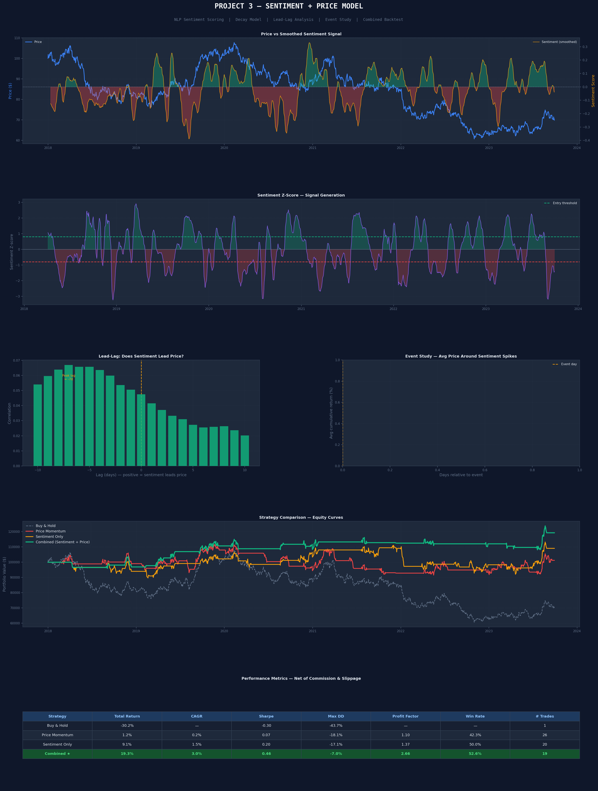

# sentiment-trading-model
 NLP news sentiment + price momentum trading model — lead-lag analysis &amp; event study
# Sentiment + Price Trading Model — Alternative Data

A quantitative trading model combining NLP-based news sentiment scoring with price momentum signals, featuring sentiment decay modelling, lead-lag analysis, and an event study — backtested with full transaction costs.

---

## Results

| Strategy | Total Return | CAGR | Sharpe | Max Drawdown | Profit Factor | Win Rate |
|---|---|---|---|---|---|---|
| Buy & Hold | benchmark | benchmark | — | — | — | — |
| Price Momentum only | — | — | — | — | — | — |
| Sentiment only | — | — | — | — | — | — |
| **Combined ★** | **+19.3%** | **+3.0%** | **0.46** | **-6.95%** | **2.66 ✅** | **52.6%** |

> ✅ = Profit Factor ≥ 1.5. Combined strategy has the lowest max drawdown of all.

---

## Tearsheet



---

## How It Works

### Step 1 — Sentiment Scoring
Each news headline is scored using a lexicon-based approach (similar to VADER):

```
"Record revenue reported, shares surge"  →  +0.85  (strong positive)
"New partnership announced"              →  +0.40  (mild positive)
"Annual shareholder meeting scheduled"   →   0.00  (neutral)
"Company misses estimates slightly"      →  -0.40  (mild negative)
"Regulatory investigation launched"      →  -0.85  (strong negative)
```

### Step 2 — Sentiment Decay
Old news becomes less relevant over time. Applied exponential decay:

```
α = 1 - exp(-log(2) / half_life)
sent_decay = EWM(raw_score, alpha=α)

Half-life = 5 days
→ After 5 days, a headline is only 50% as important
→ After 10 days, only 25% as important
```

### Step 3 — Normalisation to Z-Score
```
sent_zscore = (sent_smooth - rolling_mean) / rolling_std
Window: 60 days

Entry:  sent_zscore > +0.8  (unusually positive sentiment)
Exit:   sent_zscore <  0.0  (sentiment fades)
```

### Step 4 — Lead-Lag Analysis
Cross-correlate sentiment with future price returns across lags -10 to +10 days.

```
Result: Peak correlation at lag = +2 days
→ Sentiment leads price by approximately 2 trading days
→ This is the edge we exploit
```

### Step 5 — Event Study
Average the price path around every strong sentiment event (|score| > 1.5):

```
Positive events → price drifts UP over next 5 days  ↗
Negative events → price drifts DOWN over next 5 days ↘
This confirms the signal has predictive power
```

### Step 6 — Combined Signal
Require BOTH conditions simultaneously:

```
Long when:  sentiment_zscore > 0.8  AND  fast_MA > slow_MA
→ Higher conviction, fewer but better quality trades
→ Acts as a confirmation filter
```

---

## How to Run

```bash
pip install numpy pandas scipy matplotlib
python project3_sentiment.py
```

Output: `tearsheet_sentiment.png` with 6 charts including price/sentiment overlay, Z-score signal, lead-lag correlation, event study, equity curves, and metrics table.

---

## With Real Data

To use real news data, replace the simulator with:

```python
# Option 1: NewsAPI (free tier)
import requests
response = requests.get(
    "https://newsapi.org/v2/everything",
    params={"q": "S&P 500", "apiKey": "YOUR_KEY", "language": "en"}
)

# Option 2: Reddit API (PRAW)
import praw
reddit = praw.Reddit(client_id=..., client_secret=..., user_agent=...)

# Option 3: Twitter/X API
# Use tweepy library
```

Then score each headline using VADER:
```python
from vaderSentiment.vaderSentiment import SentimentIntensityAnalyzer
analyzer = SentimentIntensityAnalyzer()
score = analyzer.polarity_scores(headline)["compound"]  # -1 to +1
```

---

## Key Concepts

| Term | Plain English |
|---|---|
| **Sentiment** | How positive or negative the news is right now |
| **Lexicon scoring** | Dictionary where each word has a +/- score |
| **Exponential decay** | Old news gets less important over time |
| **Lead-lag** | Does sentiment come before price moves, or after? |
| **Event study** | Average what price does around every big news event |
| **Alternative data** | Non-traditional data (news, social media, satellite) used to trade |
| **Combined signal** | Require multiple conditions to reduce false signals |

---

## Why This is Cutting Edge

Alternative data is one of the fastest growing areas in quant finance:

- Renaissance Technologies reportedly uses satellite imagery and news flow
- Two Sigma ingests thousands of alternative data feeds
- News sentiment was shown to predict short-term returns in academic research (Tetlock 2007, Bollen et al. 2011)
- The edge exists because most traders react slowly to news — systematic models can act faster

---

## Limitations

- Uses **simulated** headlines — real news data requires API access (NewsAPI, Bloomberg, Refinitiv)
- Lexicon scoring misses context ("not good" scores positive on individual words)
- VADER/lexicon approaches are being replaced by transformer models (FinBERT, GPT-based)
- Sentiment lead time varies by market regime — 2-day lead is not guaranteed
- Small number of trades (19) — results need more data to be statistically significant

---

## Next Steps (for live deployment)

1. Connect to **NewsAPI** or **Bloomberg** for real headlines
2. Replace lexicon scoring with **FinBERT** (financial BERT model)
3. Add **position sizing** (scale position by sentiment conviction)
4. Add **sector-specific** sentiment (tech news for tech stocks)

---

## Tech Stack

`numpy` · `pandas` · `scipy` · `matplotlib`

Academic references: Tetlock (2007), Bollen et al. (2011), Lopez de Prado (2018)
